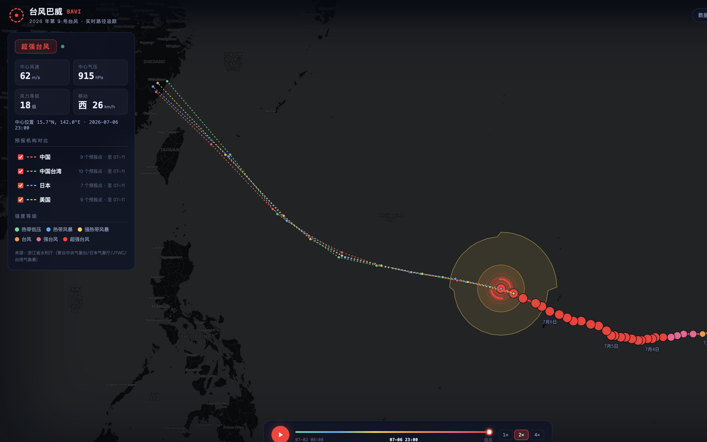
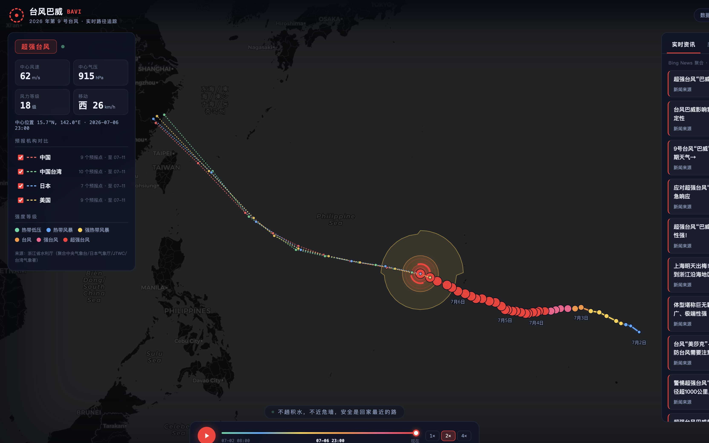
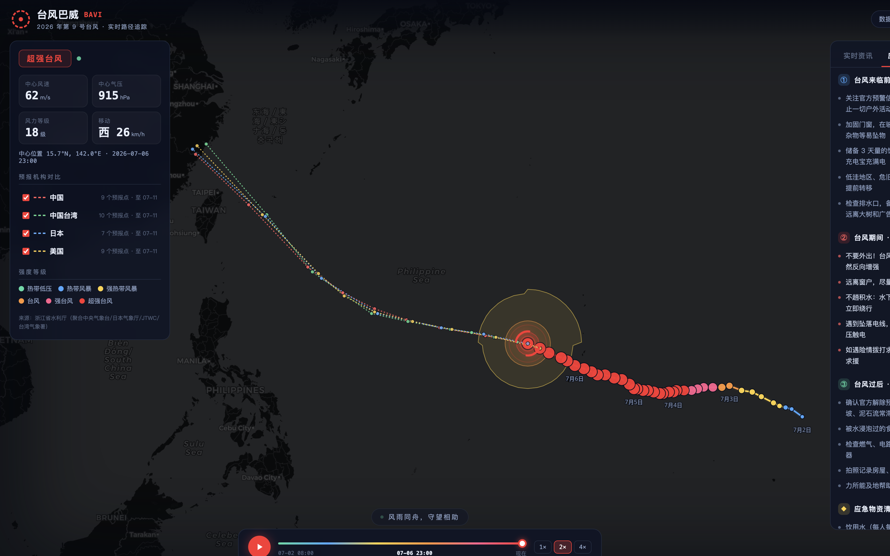

# 技术方案与共建指南

> 面向开发者、设计师、气象爱好者：如何理解这个项目、如何扩展、如何提 MR。  
> 仓库：https://github.com/Trade-Offf/typhoon-bavi-tracker  
> 线上：https://chinaupdated.com

---

## 一、我们解决什么问题

台风信息分散在多个官方站点、新闻客户端和社交平台里。普通用户很难在几分钟内回答三个问题：

1. 台风现在在哪、多强？
2. 我的城市还有多久被波及？
3. 我现在该做什么？

本项目把**数据聚合、可视化、倒计时估算、应对指南**做成一个可 7×24 访问的 Web 应用，部署在 Cloudflare 边缘，无需自建服务器。

---

## 二、架构总览

```
┌─────────────────────────────────────────────────────────────┐
│  用户浏览器（MapLibre GL + TypeScript）                        │
│  · 路径回放 / 风圈动画 / 城市标记 / HUD / 分享深链            │
└──────────────────────────┬──────────────────────────────────┘
                           │ /api/typhoon/:id  /api/news
┌──────────────────────────▼──────────────────────────────────┐
│  Cloudflare Worker（边缘代理 + 缓存 + 容灾）                   │
│  · normalize.ts  双源归一化                                   │
│  · news.ts       RSS 资讯聚合                                 │
│  · 缓存：台风 5min / 资讯 10min                               │
└──────────┬─────────────────────────────┬────────────────────┘
           │                             │
   浙江水利厅 API（主）              Google/Bing News RSS
   中央气象台 NMC（备）
```

### 技术选型理由

| 层级 | 选型 | 原因 |
|------|------|------|
| 边缘计算 | Cloudflare Workers | 零运维、全球 CDN、国内可访问 |
| 前端地图 | MapLibre GL | 开源、矢量/栅格灵活、无 Google 依赖 |
| 底图 | 高德卫星 + 中文注记 | 国内 CDN 稳定，中文标注，无跨境地图合规顾虑 |
| 构建 | Vite + TypeScript | 快速迭代，类型安全 |
| 数据 | 无数据库 | 源站返回全量轨迹，边缘缓存即可 |

---

## 三、关键功能与截图

### 1. 实时路径 + 四机构预报对比



- 实测路径按国标六级强度配色
- 中/日/美/台四家预报虚线可独立开关
- 三层风圈（7/10/12 级）四象限不等半径，随时间插值

**代码入口**：`src/map.ts` · `src/intensity.ts`

---

### 2. 城市波及倒计时


- 基于中央气象台预报路径 + 当前 7 级风圈半径
- 11 个重点城市：台北、高雄、福州、厦门、温州、宁波、杭州、上海等
- 分级建议：>48h 关注 → 24–48h 采买 → 12–24h 加固 → <12h 停止外出
- 分享深链：`?city=温州` 打开即聚焦

**代码入口**：`src/impact.ts`（纯函数，易单测）· `src/app.ts`（HUD 渲染）

---

### 3. 实时资讯聚合



- Worker 端抓取 Google News / Bing News RSS
- 边缘缓存 10 分钟，前端延迟 2.5s 加载（不阻塞地图首屏）
- 小红书：因平台反爬无法服务端抓取，保留话题深链

**代码入口**：`worker/news.ts` · `src/news.ts`

---

### 4. 台风应对指南



- 来临前 / 期间 / 过后 / 物资清单 / 紧急电话
- 静态内容，`src/guide.ts`，欢迎补充地方化指引

---

## 四、目录与模块职责

```
worker/
  index.ts       # 路由、边缘缓存、双源容灾
  normalize.ts   # CMA/ZJ 数据 → TyphoonData（纯函数）
  news.ts        # RSS 解析与聚合（纯函数）

src/
  app.ts         # 入口：回放控制、HUD、分享、倒计时刷新
  map.ts         # MapLibre 图层、城市标记、风圈动画
  impact.ts      # 城市波及倒计时算法（纯函数）
  geo.ts         # 球面距离、风圈多边形、轨迹插值
  guide.ts       # 应对指南内容
  news.ts        # 资讯面板渲染
  slogan.ts      # 正能量口号轮播
```

**设计原则**：

- 数据归一化与算法尽量写成**纯函数**（`normalize.ts`、`impact.ts`、`geo.ts`），方便单测和复用
- 绘图与动画在 `map.ts`，与业务逻辑解耦
- Worker 只做代理和缓存，不存数据库

---

## 五、本地开发

```bash
git clone git@github.com:Trade-Offf/typhoon-bavi-tracker.git
cd typhoon-bavi-tracker
npm install
npm run dev          # Vite 开发服务器
npm run typecheck    # TypeScript 检查
npm run preview      # 构建 + wrangler 本地模拟 Worker
```

本地 `vite dev` 时，`/api/typhoon` 会代理到浙江水利厅接口。完整 Worker 行为请用 `npm run preview`。

---

## 六、如何扩展（欢迎提 MR 的方向）

### 高优先级 · 防灾价值直接提升

| 方向 | 说明 | 建议改动文件 |
|------|------|-------------|
| 增加城市 | 在 `CITIES` 数组加 `{ name, lng, lat }` | `src/impact.ts` |
| 10/12 级风圈倒计时 | 扩展 `computeImpacts` 返回多级 ETA | `src/impact.ts` |
| 按定位排序城市 | `navigator.geolocation` + 距离排序 | `src/app.ts` |
| 多台风切换 | `TYPHOON_ID` 改为路由参数或列表 | `src/app.ts` · `worker/index.ts` |
| 地方化指南 | 各省防汛细则、避险点 | `src/guide.ts` |

### 中优先级 · 体验与传播

| 方向 | 说明 |
|------|------|
| i18n 繁体/英文 | 面向港澳台与外籍居民 |
| 预警等级 API 接入 | 对接中央气象台预警短信/ RSS |
| PWA 离线缓存 | 最近一次台风数据离线可读 |
| 分享卡片动态生成 | OG 图按城市倒计时动态渲染 |

### 数据源扩展（需合规评估）

| 源 | 现状 | 扩展方式 |
|----|------|----------|
| 小红书 | 反爬，无法匿名抓取 | 需用户授权 Cookie 或官方 API |
| 微博 | 需访客 Cookie | Worker 端谨慎实现，注意 ToS |
| 地方气象局 | 多数有公开接口 | 在 `worker/` 加 fetcher 模块 |

---

## 七、如何提 MR（Pull Request）

### 1. Fork 并创建分支

```bash
git clone git@github.com:<你的用户名>/typhoon-bavi-tracker.git
cd typhoon-bavi-tracker
git checkout -b feat/your-feature-name
```

### 2. 开发与自测

```bash
npm run typecheck   # 必须通过
npm run build       # 确保构建成功
npm run preview     # 本地验证 Worker + 前端联调
```

### 3. 提交规范

- **commit message**：说明「为什么」而不只是「做了什么」
- **一个 MR 只做一件事**：加城市、修数据源、改样式，分开提
- **附带验证说明**：截图或录屏，说明如何复现

示例：

```
feat(impact): 新增厦门、泉州城市倒计时

- 在 CITIES 数组补充闽南沿海城市
- 验证：打开 /?city=厦门 可看到倒计时弹窗
```

### 4. 发起 PR

在 GitHub 上对你的 Fork 点 **Compare & pull request**，填写：

- **做了什么**
- **为什么需要**（防灾场景）
- **如何验证**
- **截图**（可引用 `docs/screenshots/` 或自行补充）

### 5. 我们会看什么

- TypeScript 类型安全，无 `any` 滥用
- 不引入重量级依赖（保持首屏轻量）
- 数据源请求必须有超时和容灾
- 文案准确，避免制造恐慌
- 免责声明保留：倒计时为估算，以官方预警为准

---

## 八、性能与质量清单

当前已做的优化：

- [x] MapLibre 独立分包（主包 ~27KB）
- [x] 台风 API preload
- [x] 资讯延迟加载
- [x] 页面不可见时暂停动画
- [x] 移除国外 CARTO 底图与字体服务（消除控制台报错）
- [x] 高德瓦片 + DOM 标记替代 symbol 图层

待优化（欢迎认领）：

- [ ] 风圈多边形点数按需简化（低缩放级别）
- [ ] Service Worker 缓存最近一次 API 响应
- [ ] 图片资源 WebP 压缩（截图/OG 图）
- [ ] 单元测试：`impact.ts` · `normalize.ts` · `geo.ts`

---

## 九、部署（维护者）

```bash
npx wrangler login
npm run deploy
```

自定义域名在 `wrangler.jsonc` 的 `routes` 中配置。当前已绑定 `chinaupdated.com` 与 `www.chinaupdated.com`。

---

## 十、为什么开源

防灾信息不应被锁在个人的服务器里。

开源意味着：

- 数据源失效时，社区可以快速修复
- 沿海不同城市的人可以补充本地指南
- 算法可以被打磨得更准确
- 任何人都可以部署自己的实例

**技术人的理想主义，有时候就是写一段代码，让多一个人提前看到危险。**

欢迎 Star、Fork、提 Issue、提 MR。  
一个人力量有限，众志成城，总会集结智慧对抗天灾。

---

## 附录：截图资源索引

| 文件 | 说明 |
|------|------|
| `docs/screenshots/01-overview-city-countdown.png` | 总览：高德底图 + 城市列表 + 预警条 |
| `docs/screenshots/02-city-popup.png` | 点击城市：倒计时弹窗 + 行动建议 |
| `docs/screenshots/03-news-panel.png` | 实时资讯：多源媒体报道 |
| `docs/screenshots/04-guide-panel.png` | 应对指南：五段式清单 |
| `docs/screenshots/05-forecast-compare.png` | 四机构预报路径对比 |

口播稿见：[BROADCAST_SCRIPT.md](./BROADCAST_SCRIPT.md)
